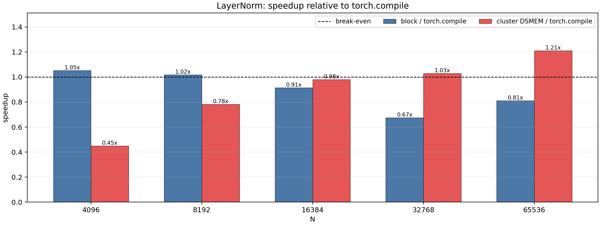
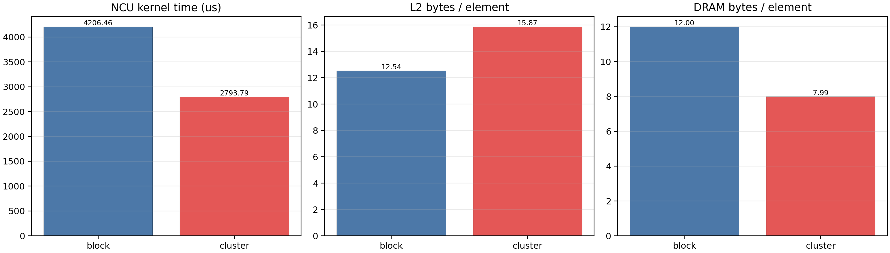

# DSMEM for Large Row-wise LayerNorm

## Goal

This experiment tests whether DSMEM can help LayerNorm on very wide rows:

```text
y = (x - mean(x)) / sqrt(var(x) + eps) * gamma + beta
```

The default baseline is `torch.compile` running PyTorch `F.layer_norm`. I also
keep a non-cluster CUDA block kernel as an internal baseline.

## Why LayerNorm Is Interesting

LayerNorm is a stronger test than RMSNorm because it requires two row-level
statistics: `sum(x)` and `sum(x^2)`. A single CTA implementation either rereads
the row from global memory or stages the entire row in local shared memory when
the row fits. For wide rows, the cluster implementation splits one row across
multiple CTAs:

1. each CTA loads a contiguous slice into local shared memory;
2. each CTA computes local `sum` and `sumsq`;
3. DSMEM is used for cross-CTA reduction of those scalar partials;
4. each CTA normalizes and writes only its own slice.

This matches the successful pattern from the row-wise reduction experiment:
DSMEM is used for compact cross-CTA reductions, not fine-grained remote element
reads.

## Files

Folder: `layernorm_dsmem_explore`

- `layernorm_bench.cu`: CUDA block and cluster-staged LayerNorm kernels.
- `run_layernorm.sh`: builds and runs the CUDA benchmark.
- `compare_layernorm_torch.py`: compares CUDA results against `torch.compile`.
- `run_compare.sh`: wrapper using the `cluster` conda environment.
- `ncu_layernorm_metrics.sh`: focused Nsight Compute profile for `N=65536`.
- `parse_layernorm_ncu.py`: converts raw NCU CSV into a compact summary.
- `plot_layernorm_results.py`: generates timing and profiler plots.

The CUDA benchmark performs sample-based correctness checks by default after
timing the selected block and cluster variants. The NCU script disables this
extra verification work with `--no-verify` so profiler captures only the target
kernels.

## Timing Method

Command:

```bash
bash layernorm_dsmem_explore/run_compare.sh \
  --batch-size 8192 \
  --n-values 4096,8192,16384,32768,65536 \
  --warmup 2 \
  --iters 5 \
  --output-csv layernorm_dsmem_explore/results/layernorm_torch_compare.csv
```

Environment:

- GPU: NVIDIA GeForce RTX 5090
- PyTorch: `2.11.0+cu130`
- CUDA arch: `sm_120`
- batch size: `8192`
- cluster size: `8`
- block `thread_per_row` candidates: `16,32,256`

The bandwidth model counts `input + gamma + beta + output`, or
`16 bytes/element`. Since all variants use the same model, speedup is equivalent
to runtime speedup.

## Timing Results

| N | block ms | block tpr | cluster ms | torch.compile ms | cluster/block | cluster/torch |
|---:|---:|---:|---:|---:|---:|---:|
| 4096 | 0.1756 | 256 | 0.4114 | 0.1847 | 0.43x | 0.45x |
| 8192 | 0.3520 | 256 | 0.4590 | 0.3586 | 0.77x | 0.78x |
| 16384 | 0.7712 | 256 | 0.7195 | 0.7057 | 1.07x | 0.98x |
| 32768 | 2.0918 | 16 | 1.3715 | 1.4101 | 1.53x | 1.03x |
| 65536 | 4.2003 | 16 | 2.8131 | 3.4055 | 1.49x | 1.21x |



Supporting plots:

- `plots/layernorm_gbps.png`
- `plots/layernorm_runtime_ms.png`

## Nsight Compute Results

Focused profile:

```bash
bash layernorm_dsmem_explore/ncu_layernorm_metrics.sh
python3 layernorm_dsmem_explore/parse_layernorm_ncu.py
```

Profiled shape: `N=65536`, `batch_size=8192`.

| Variant | NCU time us | modeled GB/s | L2 B/element | DRAM B/element |
|---|---:|---:|---:|---:|
| block | 4206.464 | 2042.08 | 12.537 | 11.998 |
| cluster | 2793.792 | 3074.65 | 15.873 | 7.991 |



## Interpretation

LayerNorm is a positive DSMEM workload, but only at wide row sizes. The cluster
path loses badly for `N=4096` and `N=8192`, is near break-even at `N=16384`,
and starts beating `torch.compile` at `N=32768` and `N=65536`.

The profiler data shows why the large shape wins. At `N=65536`, the block
kernel reads about `12.0` DRAM bytes per element. The cluster staged kernel
reduces this to about `8.0` DRAM bytes per element by loading each row slice
once and reusing it from local shared memory. This reduces NCU kernel time from
`4206.5 us` to `2793.8 us`.

The tradeoff is visible in L2 traffic: cluster L2 bytes per element increase
from `12.54` to `15.87`. That means DSMEM is not universally reducing all
memory hierarchy traffic. The win comes from reducing DRAM traffic and adding
more parallelism across a wide row; the extra L2/shared-memory-side traffic is
still cheaper than rereading the row from DRAM.

## Lessons

This reinforces the pattern from softmax/RMSNorm:

- DSMEM is useful when one logical row is too wide for one CTA to process
  efficiently.
- The DSMEM communication should be compact, such as cross-CTA scalar partials.
- The row must be wide enough to amortize cluster synchronization and launch
  constraints.
- DSMEM can win even when L2 traffic rises, if it avoids expensive DRAM rereads.

The negative result for small `N` is also important. Cluster overhead dominates
when one CTA can already stage and reduce the row efficiently.

## Next Experiments

The next candidates should be other wide-row operations with multiple row-level
statistics or multiple passes:

1. log-softmax and fused softmax-cross-entropy;
2. variance-only and standardization kernels;
3. top-k pre-reduction or approximate top-k over very wide rows;
4. attention score normalization for long sequence lengths;
5. cluster-size sweep over `2,4,8`, because cluster size 8 is not necessarily
   optimal for `N=32768`.
