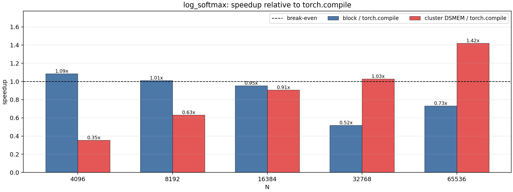
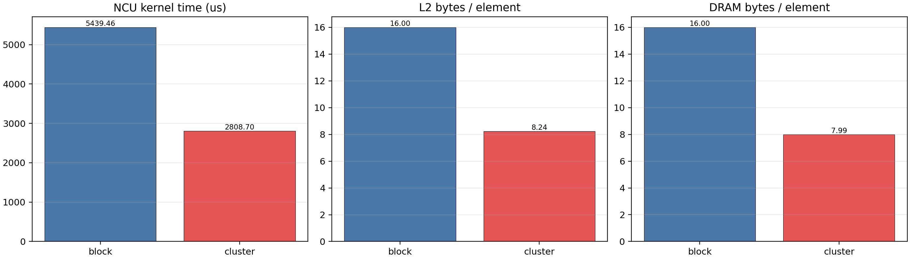

# DSMEM for Large Row-wise log_softmax

## Goal

This experiment tests whether DSMEM can help wide-row `log_softmax`:

```text
y = x - max(x) - log(sum(exp(x - max(x))))
```

The default baseline is `torch.compile` running PyTorch
`F.log_softmax(x, dim=-1)`. I also keep a non-cluster CUDA block kernel as an
internal baseline.

## Why log_softmax Is a Good DSMEM Candidate

`log_softmax` needs two row-level reductions and then writes the full row:

1. reduce row max;
2. reduce row sum of `exp(x - max)`;
3. write one output per element.

A simple block implementation rereads the row for each phase. The cluster
staged implementation splits one row across a thread-block cluster. Each CTA
loads a row slice into local shared memory, DSMEM reduces compact scalar
partials across CTAs, then each CTA writes its own output slice.

This is the same coarse-grained DSMEM pattern that worked for softmax/RMSNorm:
the inner element work stays local, and DSMEM only communicates scalar partial
reductions.

## Files

Folder: `logsoftmax_dsmem_explore`

- `logsoftmax_bench.cu`: CUDA block and cluster-staged kernels.
- `run_logsoftmax.sh`: builds and runs the CUDA benchmark.
- `compare_logsoftmax_torch.py`: compares CUDA results against `torch.compile`.
- `run_compare.sh`: wrapper using the `cluster` conda environment.
- `ncu_logsoftmax_metrics.sh`: focused Nsight Compute profile for `N=65536`.
- `parse_logsoftmax_ncu.py`: converts raw NCU CSV into a compact summary.
- `plot_logsoftmax_results.py`: generates timing and profiler plots.

The CUDA benchmark performs sample-based correctness checks by default. The NCU
script passes `--no-verify` so profiler captures only the target kernels.

## Timing Method

Command:

```bash
bash logsoftmax_dsmem_explore/run_compare.sh \
  --batch-size 8192 \
  --n-values 4096,8192,16384,32768,65536 \
  --warmup 2 \
  --iters 5 \
  --output-csv logsoftmax_dsmem_explore/results/logsoftmax_torch_compare.csv
```

Environment:

- GPU: NVIDIA GeForce RTX 5090
- PyTorch: `2.11.0+cu130`
- CUDA arch: `sm_120`
- batch size: `8192`
- cluster size: `8`
- block `thread_per_row` candidates: `16,32,256`

The bandwidth model counts three logical input passes and one output write, or
`16 bytes/element`. Since all variants use the same model, speedup is equivalent
to runtime speedup.

## Timing Results

| N | block ms | block tpr | cluster ms | torch.compile ms | cluster/block | cluster/torch |
|---:|---:|---:|---:|---:|---:|---:|
| 4096 | 0.1755 | 256 | 0.5379 | 0.1904 | 0.33x | 0.35x |
| 8192 | 0.3554 | 256 | 0.5685 | 0.3590 | 0.63x | 0.63x |
| 16384 | 0.7406 | 256 | 0.7796 | 0.7067 | 0.95x | 0.91x |
| 32768 | 2.7215 | 16 | 1.3732 | 1.4115 | 1.98x | 1.03x |
| 65536 | 5.4740 | 16 | 2.8230 | 4.0086 | 1.94x | 1.42x |



Supporting plots:

- `plots/logsoftmax_gbps.png`
- `plots/logsoftmax_runtime_ms.png`

## Nsight Compute Results

Focused profile:

```bash
bash logsoftmax_dsmem_explore/ncu_logsoftmax_metrics.sh
python3 logsoftmax_dsmem_explore/parse_logsoftmax_ncu.py
```

Profiled shape: `N=65536`, `batch_size=8192`.

| Variant | NCU time us | modeled GB/s | L2 B/element | DRAM B/element |
|---|---:|---:|---:|---:|
| block | 5439.456 | 1579.19 | 16.001 | 15.995 |
| cluster | 2808.704 | 3058.33 | 8.242 | 7.992 |



## Interpretation

`log_softmax` is a strong positive DSMEM workload for very wide rows. The
cluster path loses badly at `N=4096` and `N=8192`, remains below
`torch.compile` at `N=16384`, then wins at `N=32768` and `N=65536`.

The profiler gives a clean explanation. At `N=65536`, the block kernel reads
the row multiple times and NCU reports about `16.0` DRAM bytes per element. The
cluster staged kernel loads each CTA's slice once, reuses it from local shared
memory, and uses DSMEM only for row max and row sum reductions. DRAM traffic
drops to about `8.0` bytes per element, and NCU kernel time drops from
`5439.5 us` to `2808.7 us`.

This result is very close to the softmax result, which is expected. Both
workloads write a full row and need row-wide reductions, so there is enough
element work per row to amortize cluster synchronization when `N` is large.

## Lessons

The useful DSMEM pattern is now consistent across softmax, log_softmax, RMSNorm,
and LayerNorm:

- large row dimension;
- multiple row-wide reductions or multiple logical passes;
- full-row output, which gives enough work per row;
- DSMEM used for compact cross-CTA scalar reductions;
- staged local shared memory used for row-slice reuse.

The failure mode is also consistent: small rows are better handled by one CTA,
because cluster launch and synchronization overhead dominate.

## Next Experiments

Good follow-up candidates:

1. fused log_softmax + negative log likelihood with optional full log-prob output;
2. attention score normalization at long sequence lengths;
3. top-k or argmax pre-reductions over very wide rows;
4. cluster-size sweep over `2,4,8`, especially for `N=32768`;
5. compare against specialized library kernels where available, after narrowing
   the shape range where DSMEM helps.
