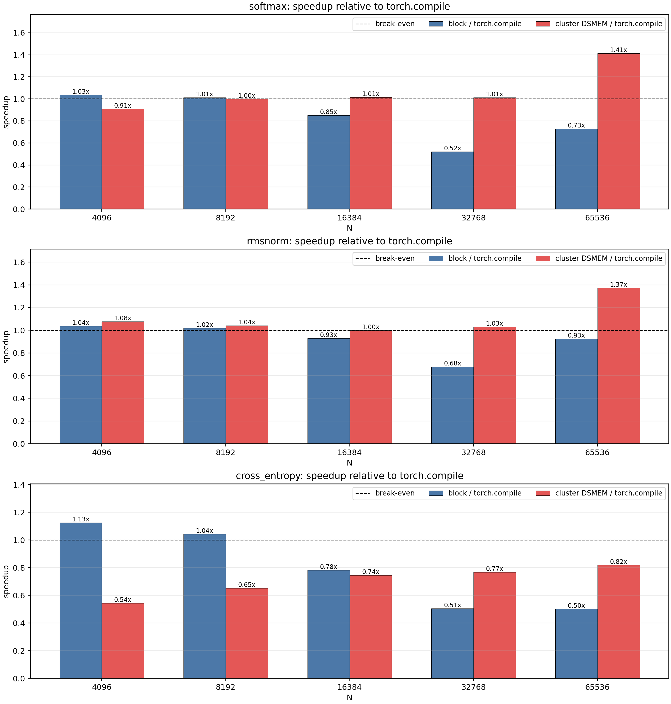
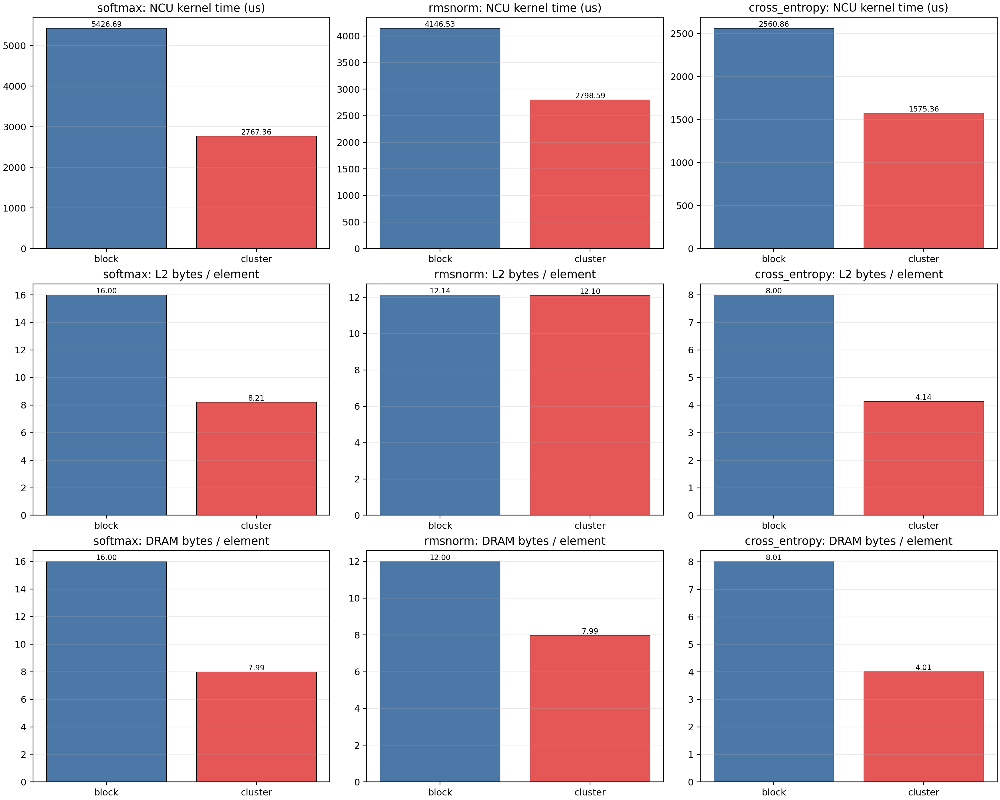

# DSMEM for Large Row-wise Reduction Workloads

## Goal

This experiment tests whether DSMEM can help workloads that reduce across very
wide rows. The tested operations are:

- `softmax(x, dim=-1)`
- `rmsnorm(x)`
- per-row `cross_entropy(logits, target, reduction="none")`

The default baseline is `torch.compile`. I also keep a non-cluster CUDA block
kernel as an internal baseline, because it shows whether DSMEM is improving our
own implementation even when it does not beat PyTorch.

## Why This Workload Can Use DSMEM

For large `N`, a single row is too wide for an efficient small-subwarp reduction.
The cluster version splits one row across multiple CTAs in a thread-block
cluster. Each CTA handles a contiguous slice of the row, then DSMEM is used for
cross-CTA reduction of row-level scalars:

- softmax: row max and row sum
- RMSNorm: row sum of squares
- cross entropy: row max, target logit, and row sum

For the staged path, each CTA first loads its row slice into local shared memory.
This avoids rereading the same global data for later reduction/output phases.
The DSMEM part is not used as random extended shared memory; it is used for
small cross-CTA reductions after each CTA has produced a local scalar.

## Method

Folder: `reduction_test`

Main files:

- `markdown_workload_bench.cu`: CUDA block and cluster kernels.
- `compare_markdown_style.py`: compares CUDA kernels against `torch.compile`.
- `run_markdown_compare.sh`: runs the comparison in the `cluster` conda env.
- `ncu_markdown_metrics.sh`: collects focused Nsight Compute metrics.
- `parse_markdown_ncu.py`: parses raw NCU CSV into a compact summary.
- `plot_markdown_results.py`: generates timing/profiler plots.

Timing command:

```bash
./reduction_test/run_markdown_compare.sh \
  --workload all \
  --batch-size 8192 \
  --n-values 4096,8192,16384,32768,65536 \
  --warmup 2 \
  --iters 5 \
  --output-csv reduction_test/results/markdown_torch_compare.csv
```

Profiler command:

```bash
bash reduction_test/ncu_markdown_metrics.sh
python3 reduction_test/parse_markdown_ncu.py
```

Hardware/software from the run:

- GPU: NVIDIA GeForce RTX 5090
- PyTorch: `2.11.0+cu130`
- CUDA arch: `sm_120`
- batch size: `8192`
- cluster size: `8`
- tuned `thread_per_row`: `16,32,256`

## Timing Summary vs torch.compile

Speedup is measured as CUDA modeled bandwidth divided by `torch.compile`
modeled bandwidth. Values above `1.0x` beat `torch.compile`.

| Workload | Cluster wins | Best N | Best cluster/torch | Block/torch at best N | Interpretation |
|---|---:|---:|---:|---:|---|
| softmax | 3 / 5 | 65536 | 1.41x | 0.73x | DSMEM cluster becomes useful when each row is very wide. |
| rmsnorm | 4 / 5 | 65536 | 1.37x | 0.93x | Cluster improves wide-row memory behavior and row parallelism. |
| cross_entropy | 0 / 5 | 65536 | 0.82x | 0.50x | Cluster improves our block kernel but still loses to PyTorch. |

At `N=65536`, the detailed timing is:

| Workload | block ms | cluster ms | torch.compile ms | cluster/torch | cluster/block |
|---|---:|---:|---:|---:|---:|
| softmax | 5.4488 | 2.8091 | 3.9704 | 1.41x | 1.94x |
| rmsnorm | 4.1807 | 2.8181 | 3.8681 | 1.37x | 1.48x |
| cross_entropy | 2.5473 | 1.5597 | 1.2762 | 0.82x | 1.63x |

The main plot is:



Supporting plots:

- `plots/markdown_gbps.png`
- `plots/markdown_runtime_ms.png`

## Nsight Compute Summary

The NCU case profiles `N=65536`, `batch_size=8192`, one timed launch per kernel.

| Workload | Variant | NCU time us | L2 B/element | DRAM B/element |
|---|---|---:|---:|---:|
| softmax | block | 5426.688 | 16.004 | 15.999 |
| softmax | cluster | 2767.360 | 8.215 | 7.991 |
| rmsnorm | block | 4146.528 | 12.137 | 11.997 |
| rmsnorm | cluster | 2798.592 | 12.102 | 7.990 |
| cross_entropy | block | 2560.864 | 8.001 | 8.011 |
| cross_entropy | cluster | 1575.360 | 4.143 | 4.011 |



## Interpretation

This is the first workload family in this exploration where DSMEM gives a clear
benefit over `torch.compile` for some shapes.

For softmax, the reason is concrete: the non-cluster block kernel reads the row
multiple times for max, sum, and output. At `N=65536`, NCU reports about
`16.0` DRAM bytes per element. The cluster staged kernel loads each CTA's row
slice once, reuses it from shared memory, performs DSMEM-based cross-CTA
reductions, and writes the output. DRAM traffic drops to about `8.0` bytes per
element, and NCU time drops from `5426.7 us` to `2767.4 us`.

For RMSNorm, the cluster path does not significantly reduce L2 bytes per
element, but it does reduce DRAM bytes per element from about `12.0` to `8.0`.
The weight vector is reused across many rows and is likely L2-friendly, while
the staged cluster path avoids rereading the input from DRAM. This produces a
real end-to-end speedup over `torch.compile` at wide `N`.

For cross entropy, the cluster path is still useful relative to our own block
kernel: DRAM bytes per element drop from about `8.0` to `4.0`, and NCU time is
about `1.63x` faster. However, it still does not beat `torch.compile`. The
likely reason is that cross entropy writes only one scalar per row, so there is
less output traffic to amortize cluster synchronization and cross-CTA reduction
overhead. PyTorch's compiled path is already strong for this reduction-only
case, while our cluster kernel pays extra DSMEM reductions for row max, target
logit, and row sum.

## What This Means for DSMEM

The positive pattern is:

- large row dimension
- multiple passes over the same row in a non-cluster implementation
- enough work per row to amortize cluster launch/sync overhead
- DSMEM used for small cross-CTA scalar reductions, not fine-grained remote
  element reads

The negative pattern is:

- small or medium `N`, where cluster overhead is not amortized
- operations with tiny output and highly optimized PyTorch reductions
- DSMEM used merely to add CTAs without reducing global traffic enough

This result is stronger than the stencil prototype because DSMEM is used in a
coarse-grained way: local CTA work stays local, and DSMEM only carries compact
reduction state across CTAs.

## Next Experiments

The next direction should stay close to this successful pattern:

1. Sweep larger `N`, including `131072`, if memory allows, because wide rows are
   where cluster DSMEM becomes valuable.
2. Sweep cluster sizes `2,4,8`; cluster size 8 is not guaranteed optimal for all
   row widths.
3. Add profiler metrics for occupancy and SM utilization to separate memory
   savings from parallelism effects.
4. Try other large-row reductions: log-softmax, top-k pre-reduction, variance,
   layernorm, and attention score normalization.
5. Compare against specialized libraries where available, not only
   `torch.compile`, after identifying shapes where DSMEM is promising.
