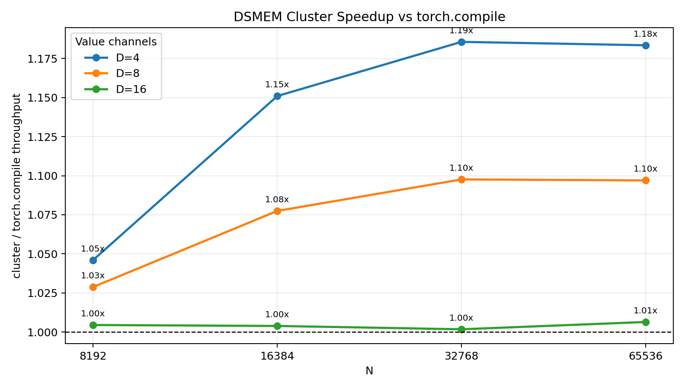
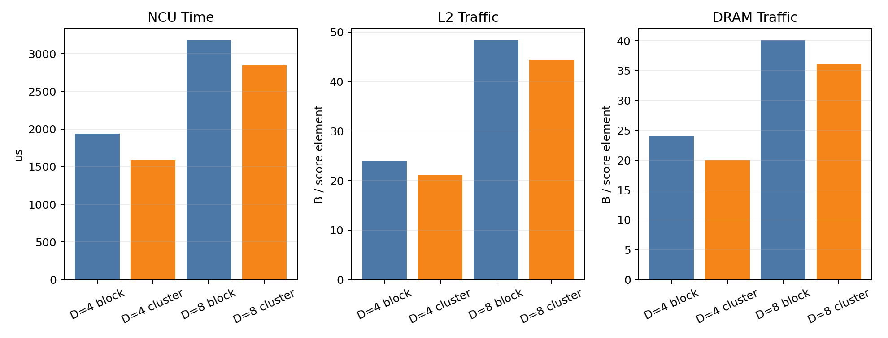

# DSMEM for Multi-Value Softmax Weighted Sum

## Goal

This experiment tests a small attention-like workload:

```text
out[row, d] = sum_j softmax(scores[row, :])[j] * values[row, j, d]
```

This is a direct extension of the scalar softmax weighted-sum experiment. The
question is whether DSMEM becomes more useful when one softmax distribution is
reused for several value channels.

The default external baseline is `torch.compile` on:

```python
(torch.softmax(scores, dim=-1).unsqueeze(-1) * values).sum(dim=1)
```

## Implementation

Folder: `softmax_multi_value_dsmem_explore`

- `multi_value_bench.cu`: CUDA kernels and benchmark.
- `run_multi_value.sh`: builds/runs the CUDA benchmark.
- `compare_multi_value_torch.py`: compares CUDA results against `torch.compile`.
- `run_compare.sh`: wrapper using the `cluster` conda environment.
- `ncu_multi_value_metrics.sh`: focused Nsight Compute profile.
- `parse_multi_value_ncu.py`: parses NCU CSV output.
- `plot_multi_value_results.py`: generates plots.

CUDA variants:

- `block_read2`: one CTA per row, reads `scores` once for max and once again for
  denominator/weighted sums.
- `block_smem`: one CTA per row, stages the full score row in local shared
  memory when the row fits in per-CTA shared memory.
- `cluster_smem`: one CTA cluster per row. Each CTA stages a slice of `scores`
  in local shared memory, uses DSMEM for cross-CTA max/sum reductions, and
  writes the final `D` outputs from rank 0.

The reported `best noDSMEM` baseline is the faster of `block_read2` and
`block_smem`.

## Timing Setup

Command:

```bash
bash softmax_multi_value_dsmem_explore/run_compare.sh \
  --rows 2048 \
  --n-values 8192,16384,32768,65536 \
  --channels-values 4,8,16 \
  --warmup 2 \
  --iters 5 \
  --cluster-size 8 \
  --output-csv softmax_multi_value_dsmem_explore/results/multi_value_torch_compare.csv
```

Environment:

- GPU: NVIDIA GeForce RTX 5090
- PyTorch: `2.11.0+cu130`
- CUDA arch: `sm_120`
- rows: `2048`
- cluster size: `8`

The throughput model counts two score reads, one value read per channel, and the
final output:

```text
bytes = rows * N * sizeof(float) * (D + 2) + rows * D * sizeof(float)
```

This is the natural noDSMEM traffic model. The NCU section below measures the
actual traffic reduction from the DSMEM path.

## Timing Results

| N | D | best noDSMEM | noDSMEM ms | DSMEM ms | torch.compile ms | DSMEM/noDSMEM | DSMEM/torch |
|---:|---:|---|---:|---:|---:|---:|---:|
| 8192 | 4 | block_smem | 0.2112 | 0.2122 | 0.2220 | 0.995x | 1.046x |
| 16384 | 4 | block_smem | 0.4315 | 0.3991 | 0.4594 | 1.081x | 1.151x |
| 32768 | 4 | block_read2 | 0.9723 | 0.7905 | 0.9372 | 1.230x | 1.186x |
| 65536 | 4 | block_read2 | 1.9325 | 1.5780 | 1.8675 | 1.225x | 1.183x |
| 8192 | 8 | block_smem | 0.3615 | 0.3629 | 0.3734 | 0.996x | 1.029x |
| 16384 | 8 | block_smem | 0.7260 | 0.7176 | 0.7732 | 1.012x | 1.077x |
| 32768 | 8 | block_read2 | 1.5864 | 1.4223 | 1.5612 | 1.115x | 1.098x |
| 65536 | 8 | block_read2 | 3.1714 | 2.8461 | 3.1221 | 1.114x | 1.097x |
| 8192 | 16 | block_smem | 0.7048 | 0.6841 | 0.6871 | 1.030x | 1.004x |
| 16384 | 16 | block_smem | 1.3744 | 1.3868 | 1.3922 | 0.991x | 1.004x |
| 32768 | 16 | block_read2 | 2.9374 | 2.8024 | 2.8073 | 1.048x | 1.002x |
| 65536 | 16 | block_read2 | 5.8707 | 5.6006 | 5.6366 | 1.048x | 1.006x |



Supporting plots:

- `plots/multi_value_runtime_ms.png`
- `plots/multi_value_gbps.png`

## Nsight Compute Results

Command:

```bash
CHANNELS=4 bash softmax_multi_value_dsmem_explore/ncu_multi_value_metrics.sh
CHANNELS=8 bash softmax_multi_value_dsmem_explore/ncu_multi_value_metrics.sh
python3 softmax_multi_value_dsmem_explore/parse_multi_value_ncu.py
```

Profiled shape: `rows=2048`, `N=65536`, cluster size `8`.

| D | Variant | NCU time us | modeled GB/s | L2 B / score element | DRAM B / score element |
|---:|---|---:|---:|---:|---:|
| 4 | block | 1938.816 | 1661.46 | 24.006 | 24.042 |
| 4 | cluster | 1585.888 | 2031.20 | 21.141 | 20.049 |
| 8 | block | 3177.120 | 1689.82 | 48.334 | 40.051 |
| 8 | cluster | 2848.448 | 1884.81 | 44.373 | 36.044 |



## Interpretation

This is a positive DSMEM workload, but the improvement is bounded.

For `D=4`, DSMEM is consistently useful once the row no longer fits local shared
memory. At `N=32768`, the cluster path reaches `1.186x` over `torch.compile` and
`1.230x` over the best noDSMEM CUDA baseline. At `N=65536`, the result remains
similar: `1.183x` over `torch.compile` and `1.225x` over noDSMEM.

NCU confirms the mechanism. For `D=4`, noDSMEM DRAM traffic is about
`24.0 B / score element`, which matches two score reads plus four value reads.
The DSMEM path reduces this to about `20.0 B / score element`, which is one
score read plus four value reads. Runtime falls from `1938.8 us` to `1585.9 us`.

The benefit shrinks as `D` increases. For `D=8`, removing one score read reduces
DRAM traffic from about `40.1` to `36.0 B / score element`, so the fractional
saving is smaller. For `D=16`, value traffic dominates and DSMEM is only around
break-even against `torch.compile`.

So the useful regime is not "more value channels is always better." The useful
regime is:

- rows are wide enough that one CTA cannot stage the full score row locally;
- score reread traffic is still a meaningful fraction of total memory traffic;
- the output has enough work to amortize cluster reductions, but not so many
  value channels that value loads dominate everything.

For this implementation, `D=4` and `N >= 16384` is the best region.

## Relation to Prior Workloads

This result sits between earlier cases:

- It is stronger than scalar weighted sum because there is more useful work per
  softmax distribution.
- It is weaker than `log_softmax` because `log_softmax` writes a full output row
  and therefore benefits more from avoiding repeated row-level work.
- It is much better than rowstats because DSMEM reduces actual DRAM traffic,
  not only cross-CTA reduction overhead.

## Next Experiments

The next targets should stay close to this positive mechanism:

1. attention-like `D=4` or `D=8` with multiple independent heads per row;
2. fused softmax weighted sum plus an additional row-wise output, so the staged
   score row is reused more than once;
3. cluster-size sweep for `D=4`, because cluster size `8` may not be optimal for
   `N=16384` and `N=32768`;
4. compare with a hand-written non-DSMEM multi-CTA global reduction baseline,
   not only one-CTA noDSMEM, to quantify the exact value of DSMEM reduction.
