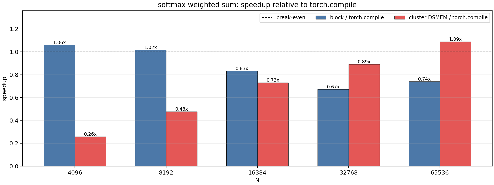
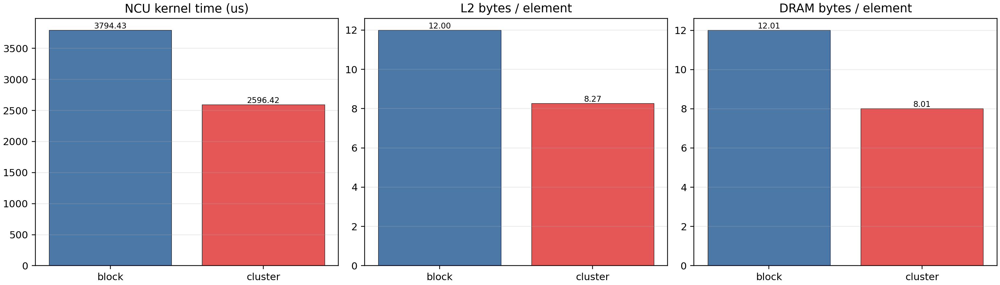

# DSMEM for Softmax Weighted Sum

## Goal

This experiment tests an attention-like wide-row reduction:

```text
out[row] = sum(softmax(scores[row]) * values[row])
```

The default baseline is `torch.compile` running:

```python
(torch.softmax(scores, dim=-1) * values).sum(dim=-1)
```

I also keep a non-cluster CUDA block kernel as an internal baseline.

## Why This Workload Matters

This workload sits between the previous positive and negative cases:

- Like softmax/log_softmax, it needs row max and row sum reductions.
- Like rowstats, it writes only one scalar per row.
- Unlike rowstats, it has a softmax dependency that makes repeated score reads
  likely in a simple implementation.

The cluster path stages each CTA's score slice in local shared memory, reads the
matching value slice, and uses DSMEM for cross-CTA reductions of:

- row max;
- softmax denominator;
- weighted numerator.

This tests whether DSMEM can help small-output softmax-style reductions.

## Files

Folder: `softmax_weighted_sum_dsmem_explore`

- `weighted_sum_bench.cu`: CUDA block and cluster-staged kernels.
- `run_weighted_sum.sh`: builds and runs the CUDA benchmark.
- `compare_weighted_sum_torch.py`: compares CUDA results against `torch.compile`.
- `run_compare.sh`: wrapper using the `cluster` conda environment.
- `ncu_weighted_sum_metrics.sh`: focused Nsight Compute profile for `N=65536`.
- `parse_weighted_sum_ncu.py`: converts raw NCU CSV into a compact summary.
- `plot_weighted_sum_results.py`: generates timing and profiler plots.

The CUDA benchmark performs sample-based correctness checks by default. The NCU
script passes `--no-verify` so profiler captures only the target kernels.

## Timing Method

Command:

```bash
bash softmax_weighted_sum_dsmem_explore/run_compare.sh \
  --batch-size 8192 \
  --n-values 4096,8192,16384,32768,65536 \
  --warmup 2 \
  --iters 5 \
  --output-csv softmax_weighted_sum_dsmem_explore/results/weighted_sum_torch_compare.csv
```

Environment:

- GPU: NVIDIA GeForce RTX 5090
- PyTorch: `2.11.0+cu130`
- CUDA arch: `sm_120`
- batch size: `8192`
- cluster size: `8`
- block `thread_per_row` candidates: `16,32,256`

The bandwidth model counts two score reads, one value read, and one scalar
output per row:

```text
bytes = rows * N * sizeof(float) * 3 + rows * sizeof(float)
```

## Timing Results

| N | block ms | block tpr | cluster ms | torch.compile ms | cluster/block | cluster/torch |
|---:|---:|---:|---:|---:|---:|---:|
| 4096 | 0.1611 | 256 | 0.6578 | 0.1705 | 0.24x | 0.26x |
| 8192 | 0.3218 | 256 | 0.6841 | 0.3271 | 0.47x | 0.48x |
| 16384 | 0.7716 | 256 | 0.8798 | 0.6422 | 0.88x | 0.73x |
| 32768 | 1.8953 | 256 | 1.4300 | 1.2729 | 1.33x | 0.89x |
| 65536 | 3.7877 | 256 | 2.5769 | 2.8051 | 1.47x | 1.09x |



Supporting plots:

- `plots/weighted_sum_gbps.png`
- `plots/weighted_sum_runtime_ms.png`

## Nsight Compute Results

Focused profile:

```bash
bash softmax_weighted_sum_dsmem_explore/ncu_weighted_sum_metrics.sh
python3 softmax_weighted_sum_dsmem_explore/parse_weighted_sum_ncu.py
```

Profiled shape: `N=65536`, `batch_size=8192`.

| Variant | NCU time us | modeled GB/s | L2 B/element | DRAM B/element |
|---|---:|---:|---:|---:|
| block | 3794.432 | 1697.88 | 12.001 | 12.011 |
| cluster | 2596.416 | 2481.30 | 8.269 | 8.010 |



## Interpretation

This is a weak positive DSMEM result.

At `N=65536`, the cluster path beats `torch.compile` by `1.09x` and beats our
block kernel by `1.47x`. NCU shows the expected memory effect: cluster staging
reduces DRAM traffic from about `12.0` to `8.0` bytes per element. Kernel time
drops from `3794.4 us` to `2596.4 us`.

However, the gain is much smaller than softmax/log_softmax. The reason is that
this workload writes only one scalar per row. There is less output-side work to
amortize cluster synchronization, and PyTorch's compiled reduction is already
strong. DSMEM still helps at the largest row size because it avoids one score
reread and adds row-level parallelism, but the benefit is marginal until the row
is very wide.

## Lessons

This result sharpens the rule:

- Full-row output is not strictly required for DSMEM to help.
- But without full-row output, the row must be very wide.
- The cluster path needs a concrete DRAM-traffic reduction; cross-CTA reduction
  alone is not enough.
- Attention-like scalar reductions may benefit from DSMEM only for long
  sequence lengths.

Compared with rowstats, this workload wins because it reduces DRAM traffic.
Compared with log_softmax, it wins less because it writes much less output and
therefore amortizes cluster overhead less effectively.

## Next Experiments

Good follow-up candidates:

1. multi-output weighted sum, e.g. softmax over scores times several value
   channels;
2. attention score normalization plus small value dimension;
3. cluster-size sweep for this workload, because cluster size 8 may be too much
   for `N=32768`;
4. compare against a PyTorch baseline that avoids materializing softmax if one
   is available.
